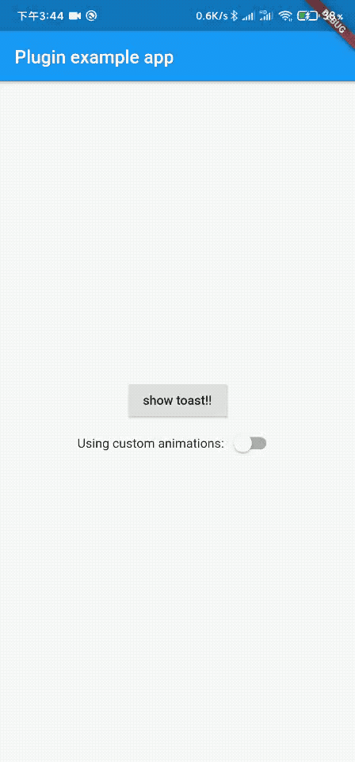

# lucky_toast 😄

A customizable toast library using flutter.
Advantage: easy to customize the animation

### Language: English | [中文简体](README_zh.md)

### Web Example

**[Sample project](https://hyccpq.github.io/lucky_toast/)**

### Renderings



### Getting started

#### 1. add dependencies into you project pubspec.yaml file

```dart
dependencies:
     lucky_toast: any
```

#### 2. import lucky_toast lib

```dart
import 'package:lucky_toast/lucky_toast.dart';
```

#### 3. initialization

Use `LuckyToastCtxGet` to wrap this widget in the outermost layer (i.e. outside of the MaterialApp widget).

> Note ⚠️: Animation effects can be defined in `LuckyToastCtxGet`, see [Custom Animation](#CustomAnimation).

```dart
runApp(LuckyToastCtxGet(child: MyApp()));
```

#### 4. use

The popup will be called from anywhere.

> Note ⚠️: The default popup duration is two seconds, which can be defined in `LuckyToastCtxGet`, the global popup duration. You can also pass this popup time when you call `simpleShow`. Priority `simpleShow` Definition > Global.

```dart
LuckyToast.simpleShow('xxxx', duration: Duration(seconds: 5));
```

#### 5. dismiss all

```dart
LuckyToast.dismiss;
```

### CustomAnimation

#### 1. create animation

First inherit `ToastAnimatedBase`, override the builder method and define the animation.

> That is `super.builder(context)`, which is used to display what you need to pop up when you call it.

```dart
class CustomToastAnimation extends ToastAnimatedBase {
  CustomToastAnimation({Duration duration}) : super(duration: duration);

  @override
  Widget builder(BuildContext context) => AnimatedBuilder(
        animation: animation,
        child: super.builder(context),
        builder: (context, child) {
          return Opacity(
            opacity: animation.value,
            child: Transform.scale(
              scale: Tween<double>(begin: 1.5, end: 1.0)
                  .transform(animation.value),
              child: child,
            ),
          );
        },
      );
}

```

#### 2. Import animation

There are two ways to import animations, you can define the global at the initialization or change it during the runtime.

1. Initialize the import
   Use the object you have defined to inherit the `ToastAnimatedBase` class, initialize it into `LuckyToastCtxGet`.

```dart
LuckyToastCtxGet(toastAnimated: CustomToastAnimation(), child: MyApp());
```

2. Change at runtime

```dart
LuckyToast.setToastAnimated(CustomToastAnimation());
```
