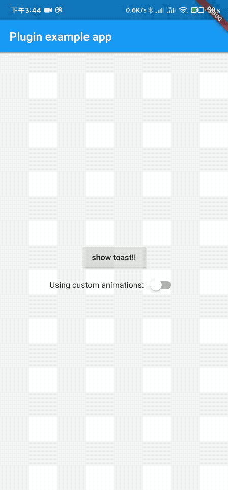

# lucky_toast 😄

一个完全使用 flutter 的可自定义的 toast 库。亮点：可轻松的自定义动画。

### Language: [English](README.md) | 中文简体

### 示例

**[Sample project](example)**

### 在线 web demo

施工中...

### 效果图



### 快速开始

#### 1. pubspec.yaml 文件里添加依赖

```dart
dependencies:
     lucky_toast: any
```

#### 2. 导入 lucky_toast 库

```dart
import 'package:lucky_toast/lucky_toast.dart';
```

#### 3. 初始化

用 `LuckyToastCtxGet` 这个小部件包装在最外层（也就是包装在 MaterialApp 小部件外部）。

> 注意 ⚠️：可以在`LuckyToastCtxGet`中定义动画效果，详见[自定义动画](#自定义动画)。

```dart
runApp(LuckyToastCtxGet(child: MyApp()));
```

#### 4.使用方式

在任意地方调用，会弹出相关内容。

> 注意 ⚠️：默认弹出时长为 2s，可在`LuckyToastCtxGet`中定义，全局弹窗时长。也可以调用 `simpleShow` 时候传入本次弹出时间。优先级 `simpleShow` 定义>全局。

```dart
LuckyToast.simpleShow('xxxx', duration: Duration(seconds: 5));
```

#### 5.清理所有 toast

```dart
LuckyToast.dismiss;
```

### 自定义动画

#### 1. 创建动画

首先继承`ToastAnimatedBase`，重写 builder 方法，定义动画。

> 注意 ⚠️：内部必须调用父类的 builder！即`super.builder(context)`，用来调用时显示你所需要弹出的内容。

```dart
class CustomToastAnimation extends ToastAnimatedBase {
  CustomToastAnimation({Duration duration}) : super(duration: duration);

  @override
  Widget builder(BuildContext context) => AnimatedBuilder(
        animation: animation,
        child: super.builder(context),
        builder: (context, child) {
          return Opacity(
            opacity: animation.value,
            child: Transform.scale(
              scale: Tween<double>(begin: 1.5, end: 1.0)
                  .transform(animation.value),
              child: child,
            ),
          );
        },
      );
}

```

#### 2.导入动画

导入动画有两种方式，可在最开始初始化时候定义全局，也可以在运行过程中改变。

1.初始化导入
用您已经定义好继承于`ToastAnimatedBase`的类，初始化的对象，放入`LuckyToastCtxGet`中即可。

```dart
LuckyToastCtxGet(toastAnimated: CustomToastAnimation(), child: MyApp());
```

2.运行时改变

```dart
LuckyToast.setToastAnimated(CustomToastAnimation());
```
